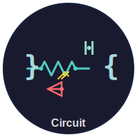

<div align="center">



# Circuit

### 🔌 The Universal Format for Electronic Circuits

**Text-based • Version-controlled • Interoperable**

[](https://opensource.org/licenses/MIT)
[](https://www.python.org/downloads/)
[](https://json-schema.org/)
[](CONTRIBUTING.md)

[Features](#-features) • [Quick Start](#-quick-start) • [CLI Tool](#-cli-tool) • [Examples](#-examples) • [Documentation](#-documentation)

---

</div>

## 🎯 Overview

**Circuit** is the markdown for electronics. A universal, human-readable JSON format for describing electronic circuits that enables:

✨ **Version Control** — Track circuit changes with Git, just like code  
🔄 **Interoperability** — Convert between Altium, KiCad, Eagle, and more  
✅ **Validation** — Automatic schema validation and design rule checking  
🎨 **Visualization** — 2D schematics and 3D PCB rendering  
🤝 **Collaboration** — Review circuits using standard PR workflows  
📚 **Education** — Human-readable format perfect for learning  

---

## ✨ Features

| Feature | Description | Status |
|---------|-------------|--------|
| **📄 JSON Format** | Simple, text-based circuit description | ✅ Ready |
| **🔍 Schema Validation** | Automatic validation with JSON Schema | ✅ Ready |
| **⚡ CLI Tool** | `circuit validate`, `export`, `render` commands | ✅ Ready |
| **🔧 Altium Export** | Convert to Altium Designer format | ✅ Ready |
| **🎨 3D Rendering** | Blender-based 3D visualization | ✅ Ready |
| **📦 KiCad Export** | Convert to KiCad format | 🚧 Planned |
| **🌐 Web Visualizer** | Interactive circuit viewer | 🚧 Planned |
| **🔁 CI/CD Integration** | GitHub Actions workflows | ✅ Ready |

---

## 🚀 Quick Start

### Installation

```bash
# Clone the repository
git clone https://github.com/Blackmvmba88/circuit.git
cd circuit

# Install dependencies
pip install -r requirements.txt

# Install CLI tool
pip install -e .
```

### Your First Circuit

Create a file `my_circuit.circuit.json`:

```json
{
  "version": "1.0",
  "metadata": {
    "name": "Simple LED Circuit",
    "description": "A basic LED with current-limiting resistor"
  },
  "components": [
    {
      "id": "R1",
      "type": "resistor",
      "value": "220Ω",
      "power": "0.25W"
    },
    {
      "id": "LED1",
      "type": "led",
      "color": "red"
    }
  ],
  "connections": [
    { "from": "VCC.positive", "to": "R1.1" },
    { "from": "R1.2", "to": "LED1.anode" },
    { "from": "LED1.cathode", "to": "GND" }
  ]
}
```

### Validate & Export

```bash
# Validate your circuit
circuit validate my_circuit.circuit.json

# Get circuit info
circuit info my_circuit.circuit.json

# Export to Altium Designer
circuit export my_circuit.circuit.json --format altium --output altium_files/

# Export BOM (Bill of Materials)
circuit export my_circuit.circuit.json --format bom
```

---

## 🎯 Why Circuit?

### The Problem
Electronic design tools are **isolated silos**. Each tool has its own proprietary format, making it difficult to:
- Version control designs
- Collaborate across teams  
- Switch between tools
- Automate workflows

### The Solution
**Circuit** provides a universal, text-based format that:
- Works with **any text editor**
- Integrates with **Git workflows**
- Converts to **any EDA tool**
- Validates **automatically**

> *"Circuit is to electronics what Markdown is to documents — simple, universal, and powerful."*

---

---

## 💻 CLI Tool

The `circuit` command-line tool makes working with circuit files effortless.

### Commands

#### Validate
```bash
circuit validate mycircuit.circuit.json
```
Validates circuit files against the JSON schema and performs semantic checks.

**Features:**
- ✅ JSON schema validation
- ✅ Component ID uniqueness
- ✅ Net connectivity validation  
- ✅ Component parameter validation
- ⚠️  Warnings for unconnected components

#### Info
```bash
circuit info mycircuit.circuit.json [--verbose]
```
Display circuit statistics and information.

**Shows:**
- 📊 Component counts by type
- 🔗 Connection statistics
- 📐 PCB dimensions
- ⚡ Circuit properties

#### Export
```bash
circuit export mycircuit.circuit.json --format <FORMAT> [--output DIR]
```

**Supported Formats:**
- `altium` — Altium Designer (Protel netlist, BOM, placement)
- `netlist` — Generic netlist format
- `bom` — Bill of Materials (CSV)
- `kicad` — KiCad (coming soon)
- `eagle` — Autodesk Eagle (coming soon)

#### Render (Planned)
```bash
circuit render mycircuit.circuit.json --3d
```
Generate 2D schematics or 3D visualizations.

---

## 📖 Examples

Check out the [`examples/`](examples/) directory for sample circuits:

### Simple LED Circuit
A basic LED circuit demonstrating the format fundamentals.
```
examples/simple_circuit.circuit.json
```

### Circuit with 3D Models  
A more complex circuit with PCB layout and 3D component models.
```
examples/circuit_with_3d.circuit.json
```

### Coming Soon
- 🔌 Linear voltage regulator
- 🎚️ Class A amplifier
- ⚙️ H-bridge motor driver
- 🔋 Switch-mode power supply
- 📻 AM radio receiver
- 💾 Digital logic (flip-flops, gates, adders)
- 🤖 Microcontroller PCB (ESP32/STM32)

---

## 📚 Documentation

| Document | Description |
|----------|-------------|
| [QUICKSTART.md](QUICKSTART.md) | Get started in 5 minutes |
| [Format Specification](schema/circuit.schema.json) | JSON Schema definition |
| [Altium Export Guide](docs/altium_export_guide.md) | Export to Altium Designer |
| [Blender Usage Guide](docs/blender_usage_guide.md) | 3D visualization with Blender |
| [ROADMAP.md](ROADMAP.md) | Project roadmap and milestones |
| [CONTRIBUTING.md](CONTRIBUTING.md) | How to contribute |

---

## 🔧 Format Overview

### Components

Define electronic components with clear, structured data:

```json
{
  "id": "R1",
  "type": "resistor",
  "package": "0805",
  "params": {
    "resistance_ohm": 10000,
    "power_rating_w": 0.125,
    "tolerance": "1%"
  }
}
```

### Nets

Connect components using nets (preferred) or point-to-point connections:

```json
{
  "id": "VCC",
  "name": "VCC",
  "connections": [
    { "component": "U1", "pin": "8" },
    { "component": "C1", "pin": "1" },
    { "component": "R1", "pin": "1" }
  ]
}
```

### Full Schema

See [`schema/circuit.schema.json`](schema/circuit.schema.json) for the complete format specification.

---

## 🔄 Adapters & Integration

### Altium Designer
Export circuits to Altium Designer format:
```bash
circuit export mycircuit.circuit.json --format altium
```

**Generates:**
- Component library (CSV)
- Netlist (Protel format)
- Bill of Materials (CSV)
- Component placement (CSV)
- Design rules (TXT)
- Import guide

See [`docs/altium_export_guide.md`](docs/altium_export_guide.md) for details.

### Blender 3D
Generate 3D PCB visualizations using Blender:
```bash
blender --python blender_models/scripts/component_generator.py -- mycircuit.circuit.json
```

See [`docs/blender_usage_guide.md`](docs/blender_usage_guide.md) for more.

### Coming Soon
- 🔧 KiCad import/export
- 📐 Eagle XML format
- 🌐 EasyEDA integration
- ⚡ LTSpice netlist export
- 🎓 Falstad circuit simulator
- 🏭 Fusion 360 PCB export

---

## 🤝 Contributing

We welcome contributions! Whether you're interested in:

- 📝 Improving documentation
- 🔧 Building new adapters
- ✨ Adding features to the CLI
- 🎨 Creating example circuits
- 🐛 Reporting bugs

Please see [CONTRIBUTING.md](CONTRIBUTING.md) for guidelines.

---

## 📜 License

This project is licensed under the MIT License - see the [LICENSE](LICENSE) file for details.

---

## 🌟 Why "Circuit"?

Just as **Markdown** revolutionized document writing and **JSON** became the universal data format, **Circuit** aims to be:

> **The universal language of electronic design.**

Simple enough for education, powerful enough for industry.

---

## 🙏 Acknowledgments

Built with ❤️ by the Circuit community.

Special thanks to all [contributors](../../graphs/contributors) and the open-source EDA community.

---

<div align="center">

**[⬆ back to top](#circuit)**

Made with 🔌 by [BlackMvmba88](https://github.com/Blackmvmba88)

</div>
